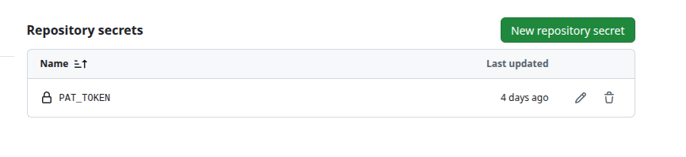
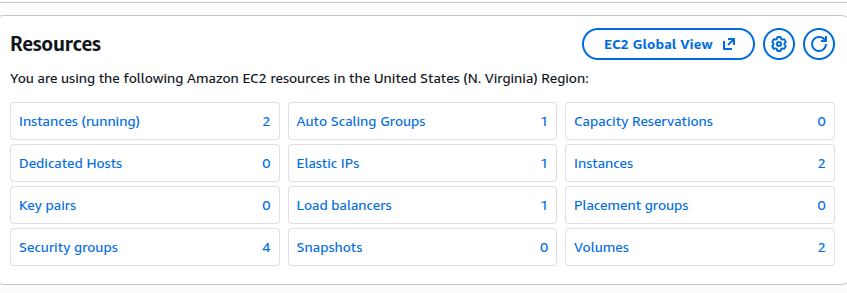
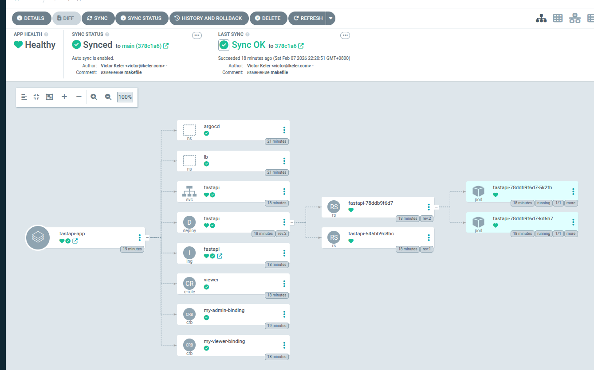

# infra_argo_code


## Описание
- Репозиторий содержит Terraform для развёртывания EKS + связанных ресурсов и манифесты Kubernetes (ArgoCD, image-updater).
- Цель: автоматизировать кластер, CI/CD и деплой приложения через ArgoCD.
- Приложение представленно в репозитории [CD_k8s](https://github.com/1KELER1/CD_k8s)
- Докер образы [приложения](https://github.com/users/1keler1/packages/container/package/cd_k8s)

## Требования
- awscli, kubectl, terraform, make
- tflint, yamllint (для локальной проверки)
- Доступ в AWS с правами на EKS/EC2/ELB/IAM
- Docker/GHCR учётка и токены


## Переменные окружения (.env)
- Файл .env подключается в Makefile. Примеры переменных с их правами:
    - DOCKER_USERNAME Логин гитхаба 
    - GHCR_SECRET_LB  (read:packages)
    - GHCR_SECRET_ARGOCD (repo read:packages write:packages)
    - GITHUB_REPO (repo read:packages write:packages)

## Токен для ранера в репозитории [CD_k8s](https://github.com/1KELER1/CD_k8s)
PAT_TOKEN ( delete:packages , repo , workflow , write:packages)




# Старт
полный запуск развёртывание при авторизации например через [переменные окружения](https://docs.aws.amazon.com/cli/latest/userguide/cli-configure-envvars.html)

```bash
make all_deploy
``` 

Удаление всех ресурсов через Terraform(для созданых IAM с ключами требутся удалить в ручную ключи)
```bash
make delete
``` 

Локальная проверка линтерами tflint, yamllint 
```bash
make linter
``` 

# CI/CD
| Шаг | Действие            | Инструмент     | Время          |
| --- | ------------------- | -------------- | -------------- |
| 0   | make all_deploy     | Terraform/EKS  | 10 мин (1 раз) |
| 1   | PR → CD_k8s         | Developer      | 1 сек          |
| 2   | Lint проверка       | GitHub Actions | 30 сек         |
| 3   | Merge PR → main     | Developer      | Ручное         |
| 4   | Lint + Docker Build | GitHub Actions | 30 сек         |
| 5   | Push GHCR           | Docker         | 1 мин          |
| 6   | Прямой push         | Image Updater  | 10 сек         |
| 7   | ArgoCD Sync         | Kubernetes     | 30 сек         |


## Terraform создаёт

- **EKS кластер** с управляемой плоскостью управления
- **рабочие узлы (EC2)** с автоскейлингом через Auto Scaling Group
- **IAM роли и политики** для EKS, узлов и сервисных аккаунтов  
- **VPC, подсети, маршруты и security groups** для сетевой изоляции
- **Classic Load Balancer (ELB/CLB)**  **автоматически** от NGINX Ingress (`type: LoadBalancer`)
- **NGINX Ingress Controller**  L7 маршрутизация + TLS termination в namespace `ingress`
- **ArgoCD и image-updater** через Helm провайдер (для CD автоматизации)
- **RBAC ролей и привязки** для разработчиков и менеджеров





# argocd
смотрит в репозитории инфрасруктуры https://github.com/1KELER1/infra_argo_code
и в хранилище докер образов приложения ghcr.io/1keler1/cd_k8s

